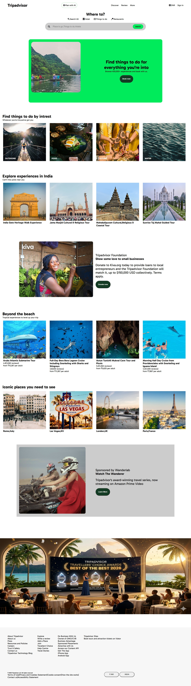

# 🌍 Tripadvisor Clone (Frontend)

A responsive Tripadvisor-inspired travel website built using **HTML & CSS**.

---

## 🚀 Features

* Modern UI design
* Responsive layout (mobile-friendly)
* Hero search section
* Travel categories (Outdoors, Food, Culture, Water)
* Explore destinations
* Interactive hover effects
* Clean footer section

---

## 🛠️ Technologies Used

* HTML5
* CSS3 (Flexbox, Media Queries)
* Google Fonts (Gabarito)
* Font Awesome Icons

---

## 📂 Project Structure

```
├── images
├── index.html
├── style.css


```

---

## 📸 Output Preview



---

## 📄 Code Files

* HTML → 
* CSS → 

---

## 📱 Responsive Design

* Works on desktop and mobile devices
* Media queries used for screens below 600px

---

## ✨ Author

* Apsal

---

## ⭐ Future Improvements

* Add JavaScript functionality
* Connect to real APIs
* Improve animations
* Add login system

---
